# Tormentas De Novembro

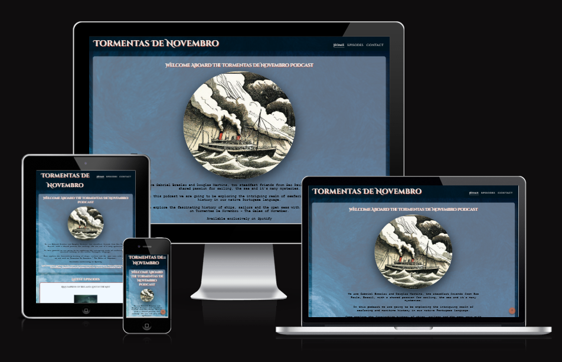

Visit the deployed site: [Tormentas De Novembro](https://begoodorbelucky.github.io/TormentasDeNovembro/index.html)

### Welcome Aboard Tormentas De Novembro

### About Us

Tormentas de Novembro is a Brazilian podcast discussing sea-faring histories and mysteries. This website is the premier port of call for any martime enthusiasts to listen to this riveting podcast. We will dive into the depths of captivationg conversation, unravel maritime mysteries, and set sail into the open ocean of nautical history. Join us for an immersive journey into uncharted waters.

## Contents

- [Tormentas De Novembro](#tormentas-de-novembro)
    - [Welcome Aboard Tormentas De Novembro](#welcome-aboard-tormentas-de-novembro)
    - [About Us](#about-us)
  - [Contents](#contents)
  - [User Experience (UX)](#user-experience-ux)
    - [Project Goals](#project-goals)
    - [Color Scheme](#color-scheme)
    - [Typography](#typography)
  - [Features](#features)
    - [General](#general)
    - [Landing Page](#landing-page)
    - [Episodes Page](#episodes-page)
    - [Contact Page](#contact-page)
  - [Technologies Used](#technologies-used)
    - [Languages Used](#languages-used)
    - [Websites and Programs Used](#websites-and-programs-used)
  - [Testing](#testing)
    - [Code Validation](#code-validation)
    - [Accessibility](#accessibility)
    - [Automated Testing](#automated-testing)
    - [Manual Testing](#manual-testing)
- [Finished Product](#finished-product)
- [Deployment](#deployment)
- [Credits](#credits)
    - [Content](#content)
    - [Media](#media)

---

## User Experience (UX)

### Project Goals

- Successfully lauch the "Tormentas De Novembro" website featuring a homepage, an episodes archive page, and a contact page.
- Design an intuitive and visually appealig website interface that enchances user experience and encourages easy navigation
- Ensure the website is fully responsive on all screen sizes, with a focus on mobile first design, providing a seamless and enjoyable experience on all devices.
- Create a comprehensive episodes archive showcasing all episodes complete with spotify links and iframes to enchance accessibility to episodes and encourage listening.
- Create a user-friendly contact form for listeners to give feedback and suggestions, fostering direct communication with the audience.

### Color Scheme

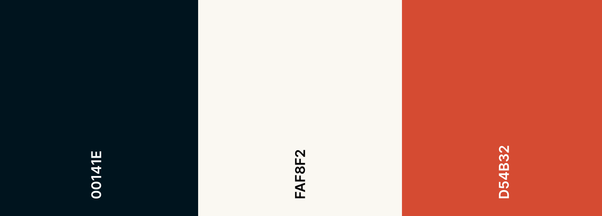

The colors used in the site are various shades of blue (#00141e-"Rich Black"), white (#faf8f2-"Baby Powder") and red (#d54b32-"Chili Red"). Layered in various opacities, these colors are reminiscent of a ship in distress on a stormy ocean. Though various tones of these colors are used to give depth to the website, these shades are used predominantly throughout the website to give a cohesive appearance.

### Typography

The main font used in the heading elements is 'Cinzel Decorative', with 'Courier New', Courier, and 'Monospace' used as a fallback should the 'Cinzel Decorative' not import correctly. 'Courier New' is then used throughout the rest of the site, with 'Courier' and 'Monospace' as fallbacks.

## Features

### General

- An intuitive and visually pleasing design that encourages easy nativation.
- The header, navigation and footer elements are identical on all pages to ensure ease of navigation.
- Similar aesthetic and colors used throughout the site maintains visual cohesion and intuitive design.
- The website is fully responsive, ensuring a smooth and engaging experience on all devices.
- The website seamlessly integrates instagram, spotify and email links to encourage engagement across multiple platforms.
- A floating button on all pages that allows users to navigate back to the top of the current page instantly.

- **Header**

  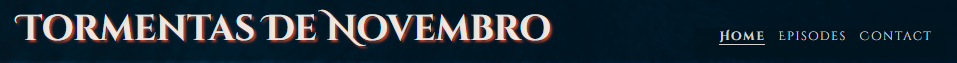

  - The header spans the top of the page and features the podcast logo and a completely responsive navigation bar. It is identical on all pages of the website to ensure ease of navigation.
  - The logo serves as a link back to the landing page

- **Navigation Menu**

  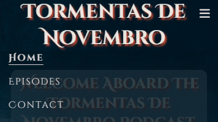

  - The fully responsive navigation bar features positional in the header features links to the following pages:

  * Home Page - Takes users to the main page of the website.
  * Episodes - Navigates to a page showcasing a list of all available podcast episodes.
  * Contact Form - Takes users to the contact page where they can submit any questions, suggestions or comments.

- **Footer**

  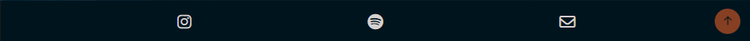

  - The footer features social media icons which directly link users to the relevant instagram, spotify and email links.
  - The footer is identical on all pages of the website to ensure ease of navigation.

### Landing Page

- The landing page provides a starting point for users to explore the introduction to the podcast and the recent episodes.

### Episodes Page

- The episodes page provides a comprehensive episode archive that showcases all available episodes of the podcast.
- The embedded spotify players allow the user to listen to the episode without leaving the page.

### Contact Page

- The contact page features an ostentatious contact form to encourage engagement and feedback.

## Technologies Used

### Languages Used

- [HTML](https://www.w3schools.com/html/html_intro.asp)
- [CSS](https://www.w3schools.com/css/css_intro.asp)

### Websites and Programs Used

- [Google Fonts](https://fonts.google.com/)

  - Google fonts was used to import the font 'Cinzel Decorative', which was used as the logo font and throughout the rest of the site to give a cohesive appearance.

- [Font Awesome](https://fontawesome.com/)
  - Font Awesome was used to add the Spotify, Instagram and Email icons to the website, providing a recognizable link to the relevant pages.
- [Codeanywhere](https://codeanywhere.com/)

  - Codeanywhere was used as the integrated development environment for writing, committing, and pushing code to GitHub.

- [Github](https://github.com/)

  - Github was used to store the code, as well as facilitate version control.

- [Am I Responsive?](https://ui.dev/amiresponsive)

  - 'Am I Responsive' was used to visualize and test how the website appears on different screen sizes, including desktops, tablets, and mobile devices.

- [Chrome Developer Tools](https://developer.chrome.com/docs/devtools/)

  - Chrome DevTools was used to to inspect, debug, and optimize the performance of the podcast website.

- [W3C Markup Validator](https://validator.w3.org/)

  - W3C Markup Validator was used to validate the HTML code.

- [W3C CSS Validator](https://jigsaw.w3.org/css-validator/)
  - W3C CSS Validator was used to validate the CSS code.

## Testing

### Code Validation

- [W3C Markup Validator](https://validator.w3.org/) was used to ensure quality and compliance of the HTML code in this project.

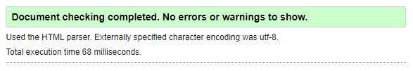

- [W3C CSS Validator](https://jigsaw.w3.org/css-validator/) was used to ensure the quality and compliance of the CSS code in this project.

  - [Index.html CSS Validation](https://jigsaw.w3.org/css-validator/validator?uri=https%3A%2F%2Fbegoodorbelucky.github.io%2FTormentasDeNovembro%2Findex.html&profile=css3svg&usermedium=all&warning=1&vextwarning=&lang=en)

  - [Episodes.html CSS Validation](https://jigsaw.w3.org/css-validator/validator?uri=https%3A%2F%2F8000-begoodorbelucky-tormenta-bcevv7yllh.us2.codeanyapp.com%2Fepisodes.html&profile=css3svg&usermedium=all&warning=1&vextwarning=&lang=en)

  - [Contact.html CSS Validation](https://jigsaw.w3.org/css-validator/validator?uri=https%3A%2F%2Fbegoodorbelucky.github.io%2FTormentasDeNovembro%2Fcontact.html&profile=css3svg&usermedium=all&warning=1&vextwarning=&lang=en)

### Accessibility

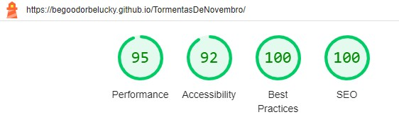

- [Lighthouse](https://developer.chrome.com/docs/lighthouse/overview/)
  was used to ensure the accessibility of the project, to guarantee an inclusive and user-friendly experience for all visitors.

### Automated Testing

- [Chrome DevTools](https://developer.chrome.com/docs/devtools/)
  -Chrome DevTools was used to continuously monitor the project, ensuring the website's responsiveness and visual appeal on all device size.

- [Am I Responsive?](https://ui.dev/amiresponsive)
  -'Am I Responsive' was also used to ensure the website was fully responsive across a range of device sizes.

### Manual Testing

- Cross-Browser Compatibility:

  - Manual testing was conducted on different browsers (e.g., Chrome, Firefox, Safari) to ensure consistent performance.

- Device Compatibility:
  - The website has been tested on several different devices to successfully demonstrate there are no appearance, functionality or responsiveness issues. The devices tested include:
    - **Samsung Galaxy S22 Ultra**
    - **Toshiba Satellite L50-C**
    - **IPhone XE**
    - **iPad 10.2-inch (9th Generation)**
    - **Macbook Air 13.3-inch**

# Finished Product

| Page     | Desktop version                                                           | Mobile version                                                          |
| -------- | ------------------------------------------------------------------------- | ----------------------------------------------------------------------- |
| Index    | 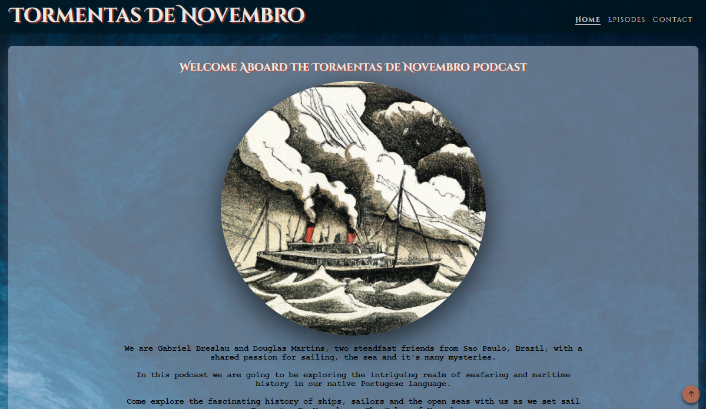       | 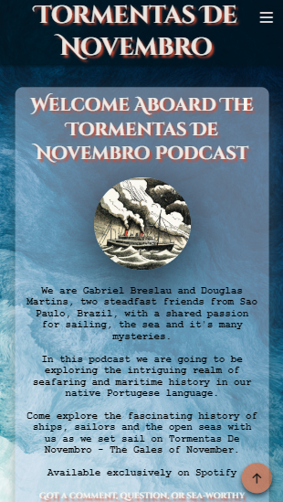       |
| Episodes | 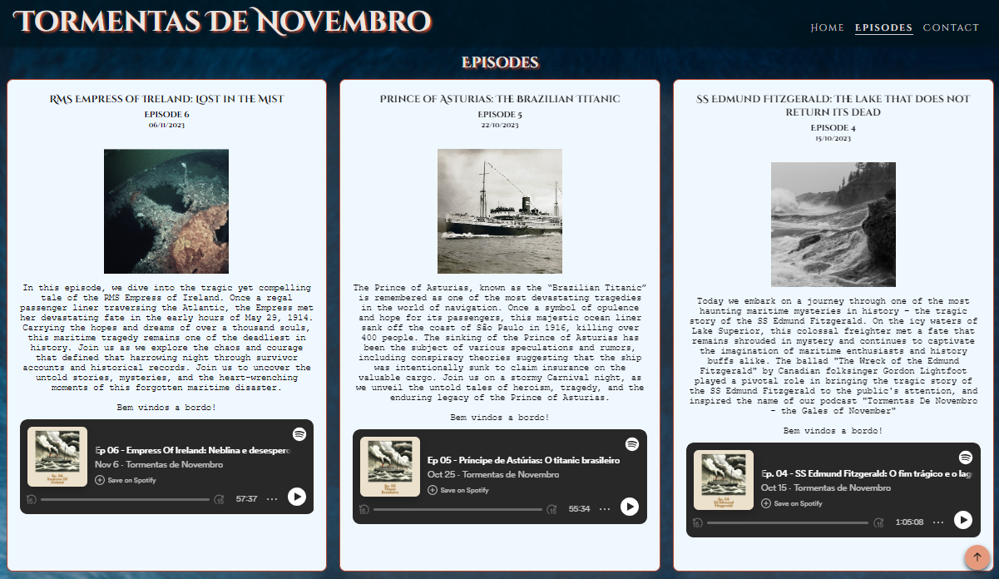 | 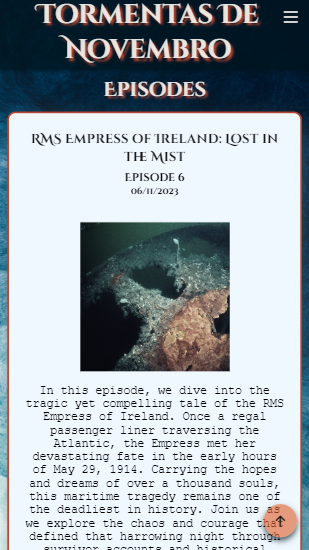 |
| Contact  | 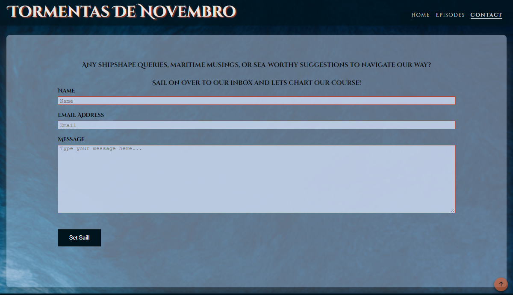   | 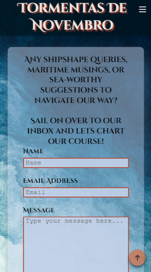   |

# Deployment

- The code for this website was written on [CodeAnywhere](https://codeanywhere.com/), which was then commited and pushed to [Github](https://github.com/).

# Credits

### Content

- This website's content was written by the developer, with guidance from the podcast creators, Gabriel Breslau and Douglas Martins.

### Media

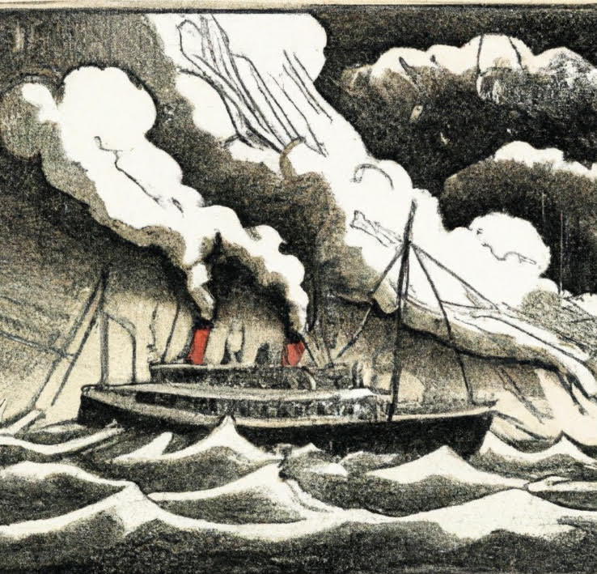

- The podcast logo was created by Gabriel Breslau.

* [Shutterstock](https://www.shutterstock.com/)

  - Background image: [Abstract Art Blue Paint Background Liquid](https://www.shutterstock.com/image-illustration/abstract-art-blue-paint-background-liquid-1802211250) by [Korkeng](https://www.shutterstock.com/g/korkeng/about)
  - Episode One Image: [Ship on Foggy Morning Ghost Fog](https://www.shutterstock.com/image-photo/ship-on-foggy-morning-ghost-fog-1010106658) taken by [Sonia Hache](https://www.shutterstock.com/g/SoniaHache/about)
  - Episode Two Image: [Still Life Pirate Skull Knife Mouth](https://www.shutterstock.com/image-photo/still-life-pirate-skull-knife-mouth-174521960) taken by [Baimieng](https://www.shutterstock.com/g/worac/about)
  - Episode Three Image: [Lone Yacht Sailing Adriatic Sea Black](https://www.shutterstock.com/image-photo/lone-yacht-sailing-adriatic-sea-black-65088772) taken by [Alexey Stiop](https://www.shutterstock.com/g/alexeys)
  - Episode Four Image: [Storm Punishes Coast Michigan Huge Waves](https://www.shutterstock.com/image-photo/storm-punishes-coast-michigan-huge-waves-1230694003) taken by [BJontzPhoto](https://www.shutterstock.com/g/BJontzPhoto)
  - Episode Six Image [Wreck Ocean Liner Empress Ireland](https://www.shutterstock.com/image-photo/wreck-ocean-liner-empress-ireland-1215871699) taken by [RLS Photo](https://www.shutterstock.com/g/RLS+Photo)

* [Wikimedia Commons](https://commons.wikimedia.org/wiki/Main_Page)

  - Episode Five Image: [Vapor Príncipe de Asturias en Pruebas de Mar](https://commons.wikimedia.org/wiki/File:Vapor_Pr%C3%ADncipe_de_Asturias_en_pruebas_de_mar.JPG) (Public Domain - Photographer is unknown)
